# Arquitectura y responsabilidades de `repo-patcher`

## 1. Objetivo

Este documento define:

- qué componentes participan en la generación, transporte, validación, aplicación y publicación de un paquete `repo-patcher`;
- qué responsabilidad pertenece a cada componente;
- con qué tecnología está construido o se construirá cada componente;
- qué piezas existen ya en el repositorio;
- qué piezas pertenecen a la dirección v7 y todavía no están implementadas;
- dónde están los límites de confianza y qué componente puede ejecutar código del paquete.

Este documento **no define la semántica del formato `patch.yaml` ni del runtime**. Esa autoridad permanece en:

```text
gobierno/USO-DE-REPO-PATCHER.md
```

La implementación vendorizada del motor permanece en:

```text
tooling/repo-patcher-runtime/repo_patcher/
```

## 2. Estado de las decisiones

### 2.1. Decisiones aceptadas

1. La validación de una candidata debe ser automática y no debe modificar `main`.
2. La candidata debe validarse contra un SHA completo y explícito del repositorio.
3. La identidad del ZIP se representa mediante su SHA-256 exacto.
4. Los plugins solo se ejecutan durante la validación remota si la solicitud contiene consentimiento explícito.
5. La validación remota usa un runner Windows hospedado por GitHub.
6. El camino interactivo v7 usará un puente local saliente que invoque `workflow_dispatch`.
7. El puente local no ejecutará RepoPatcher, plugins, generadores ni validadores del paquete.
8. La cola programada v6 se conservará como mecanismo de recuperación, no como camino interactivo principal.
9. Aplicar un paquete aceptado requiere una aprobación explícita de Samuel.
10. Después de esa aprobación, la aplicación, las comprobaciones, el commit y el push podrán automatizarse.

### 2.2. Propuestas provisionales

1. El puente consultará GitHub aproximadamente cada dos segundos durante una sesión activa.
2. El puente se instalará mediante el Programador de tareas de Windows al iniciar sesión.
3. El workflow v7 aceptará una fuente `issue` además de la fuente manual mediante rama portadora.
4. La lógica de validación se extraerá del YAML a `validate_candidate.py`.
5. La publicación local se encapsulará en un wrapper como `Apply-ValidatedRepoPatch.ps1`.

### 2.3. Cuestiones abiertas

1. Intervalo de consulta definitivo del puente y política de backoff.
2. Formato exacto del recibo de dispatch almacenado en la issue.
3. Si el instalador local realizará el push en la misma confirmación que el commit o pedirá una segunda confirmación.
4. Política de retención de resultados y artifacts más allá de los catorce días actuales.
5. Umbral de latencia que deberá cumplirse antes de declarar v7 operativa.

### 2.4. Alternativas descartadas como camino principal

- cron de GitHub Actions;
- `issue_comment` como única fuente de baja latencia;
- servidor doméstico;
- endpoint público o túnel hacia el portátil;
- runner autoalojado en el portátil;
- MCP personalizado con acciones, mientras ChatGPT Plus no lo permita;
- ejecutar la validación no confiable directamente en el portátil.

## 3. Requisitos

### 3.1. Requisitos funcionales

El sistema debe:

1. recibir exactamente los bytes del ZIP candidato;
2. asociar la candidata a un `request_id` único;
3. asociarla a un `target_sha` completo;
4. verificar tamaño y SHA-256 del ZIP;
5. verificar la estructura segura del ZIP;
6. ejecutar la versión vendorizada de RepoPatcher;
7. ejecutar `package-info`, `explain`, `check`, `apply`, validadores, `git diff --check`, `check` posterior e idempotencia;
8. registrar si existe plugin y si fue autorizado;
9. conservar logs, diff y metadatos;
10. devolver un resultado estructurado;
11. permitir corregir y repetir una candidata sin intervención manual de Samuel;
12. demostrar que el ZIP entregado es el mismo ZIP que obtuvo resultado correcto.

### 3.2. Requisitos no funcionales

El sistema debe aspirar a:

- detección interactiva en menos de tres segundos;
- comienzo del workflow sin esperar un cron;
- validación habitual en menos de un minuto;
- ausencia de escritura sobre el checkout canónico durante la validación;
- ausencia de credenciales de escritura en el proceso que ejecuta plugins;
- ausencia de puertos entrantes en el portátil;
- tolerancia a suspensión y apagado del portátil;
- deduplicación de solicitudes y reintentos;
- trazabilidad mediante `request_id`, `target_sha`, SHA-256 y `run_id`;
- posibilidad de sustituir el orquestador sin reescribir el motor de validación.

## 4. Contexto del sistema

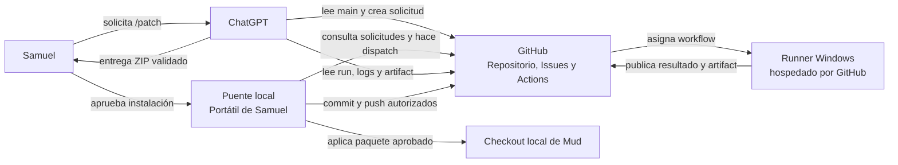

### 4.1. Frontera conceptual

```text
PROPONER Y VALIDAR
ChatGPT + GitHub + runner remoto

ACEPTAR Y PUBLICAR
Samuel + instalador local + Git
```

Una validación correcta demuestra aplicabilidad y resultado esperado. No representa por sí sola la decisión de incorporar el cambio a `main`.

## 5. Inventario de componentes

### 5.1. Componentes construidos en v6

| Componente | Ubicación | Tecnología | Responsabilidad | Estado |
| --- | --- | --- | --- | --- |
| Runtime RepoPatcher | `tooling/repo-patcher-runtime/repo_patcher/` | Python | Interpretar, comprobar y aplicar paquetes | Construido y vendorizado, versión 0.2.0 |
| Guía autoritativa del runtime | `gobierno/USO-DE-REPO-PATCHER.md` | Markdown | Documentar formato y comportamiento real | Construida y vigente |
| Transporte por Issues | `tooling/repo-patcher-ci/issue_transport.py` | Python, biblioteca estándar | Codificar, validar y reconstruir ZIP mediante issue y comentarios Base64 | Construido |
| Cola programada | `tooling/repo-patcher-ci/issue_queue.py` | Python, API REST de GitHub | Seleccionar solicitudes, reclamar, reconstruir, finalizar y cerrar | Construida |
| Inspección auxiliar | `tooling/repo-patcher-ci/package_checks.py` | Python | Detectar plugin sin importarlo y comprobar idempotencia semántica | Construida |
| Workflow remoto | `.github/workflows/validate-repo-patcher.yml` | GitHub Actions, YAML, Bash y PowerShell | Preparar, validar y finalizar solicitudes | Construido y activo |
| Envío manual inmediato | `tooling/repo-patcher-ci/Submit-RepoPatch.ps1` | PowerShell, Git, GitHub CLI y Python | Crear rama portadora, subir ZIP, hacer dispatch y localizar el run | Construido; requiere ejecución local manual |
| Recolección manual | `tooling/repo-patcher-ci/Collect-RepoPatchRun.ps1` | PowerShell y GitHub CLI | Seguir el run, descargar artifact y retirar la rama temporal | Construido |
| Consentimiento de plugin | `tooling/repo-patcher-ci/PluginConsent.ps1` | PowerShell | Obtener consentimiento local explícito | Construido |
| Instalador del kit CI | `tooling/repo-patcher-ci/Install-RepoPatcherCI.ps1` | PowerShell | Instalar y verificar el kit v6 | Construido |
| Verificación local del kit | `tooling/repo-patcher-ci/Test-GitHubWorkflow.ps1` | PowerShell, Python y actionlint | Compilar, probar y validar el workflow | Construida |
| Pruebas | `tooling/repo-patcher-ci/test_*.py`, `Test-PluginConsent.ps1` | Python y PowerShell | Probar transporte, cola, runtime, consentimiento y contrato | Construidas |

### 5.2. Componentes decididos para v7 y todavía no construidos

| Componente | Ubicación prevista | Tecnología prevista | Responsabilidad | Estado |
| --- | --- | --- | --- | --- |
| Motor canónico de validación | `tooling/repo-patcher-ci/validate_candidate.py` | Python | Ejecutar toda la secuencia de validación y producir salida estructurada | Pendiente |
| Puente local | `tooling/repo-patcher-bridge/bridge.py` | Python y GitHub CLI o REST | Detectar solicitudes y hacer dispatch inmediato | Pendiente |
| Instalador del puente | `tooling/repo-patcher-bridge/Install-Bridge.ps1` | PowerShell y Programador de tareas | Instalar el puente al iniciar sesión | Pendiente |
| Configuración del puente | `tooling/repo-patcher-bridge/bridge-config.json` | JSON | Configurar repo, workflow, intervalo y rutas de estado | Pendiente |
| Dispatch desde issue | `.github/workflows/validate-repo-patcher.yml` | GitHub Actions | Validar una issue concreta sin rama portadora | Pendiente |
| Wrapper de aplicación validada | `tooling/repo-patcher-ci/Apply-ValidatedRepoPatch.ps1` | PowerShell, Git y Python | Verificar evidencia, aplicar, comprobar, hacer commit y push autorizados | Pendiente |
| Pruebas de latencia y extremo a extremo | `tooling/repo-patcher-ci/test_end_to_end.py` o equivalente | Python y GitHub API | Medir fiabilidad y percentiles | Pendiente |

## 6. Arquitectura construida: v6

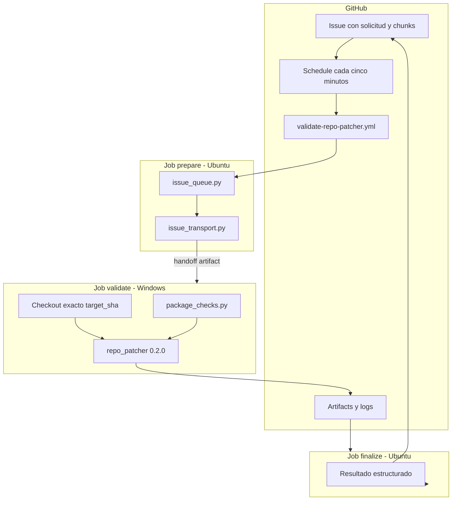

### 6.1. Secuencia de la cola programada v6

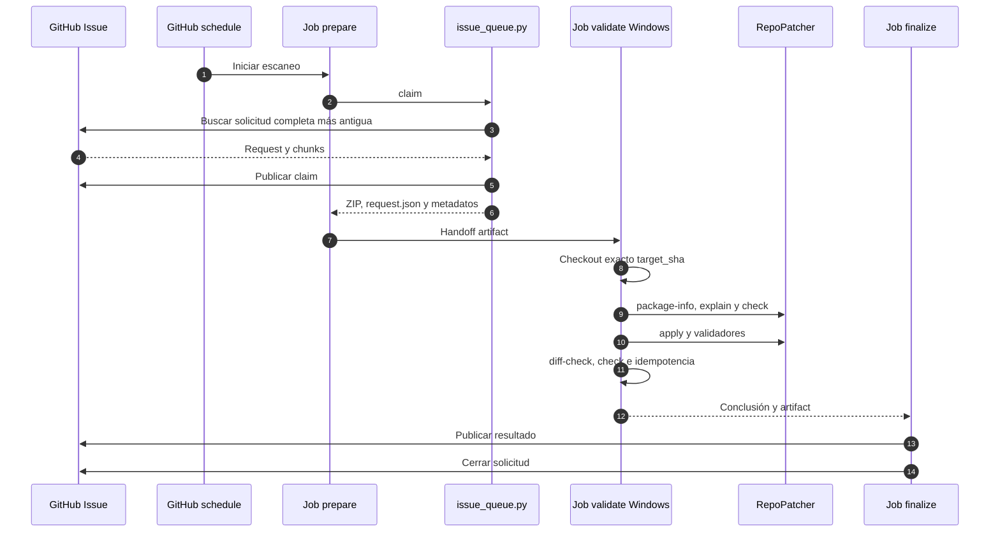

### 6.2. Camino manual inmediato ya construido

Este camino demuestra que `workflow_dispatch` puede iniciarse inmediatamente desde el portátil. Su inconveniente es que Samuel debe ejecutar el script y el ZIP se transporta mediante una rama temporal.

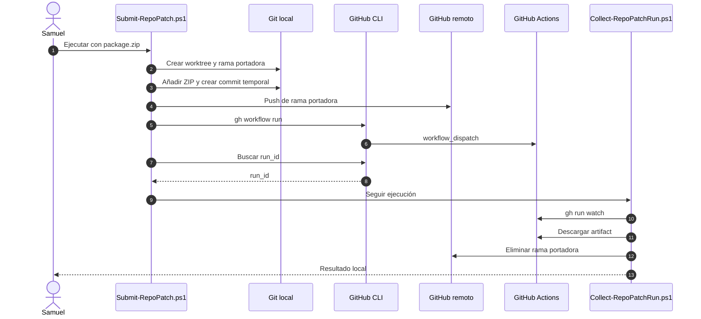

## 7. Arquitectura decidida: v7

La dirección v7 conserva el runner remoto y sustituye la intervención manual por un puente local. El camino normal ya no necesita una rama portadora: el ZIP permanece en la issue y el dispatch identifica la issue concreta.

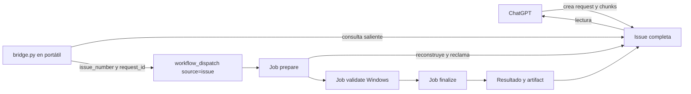

### 7.1. Secuencia interactiva v7

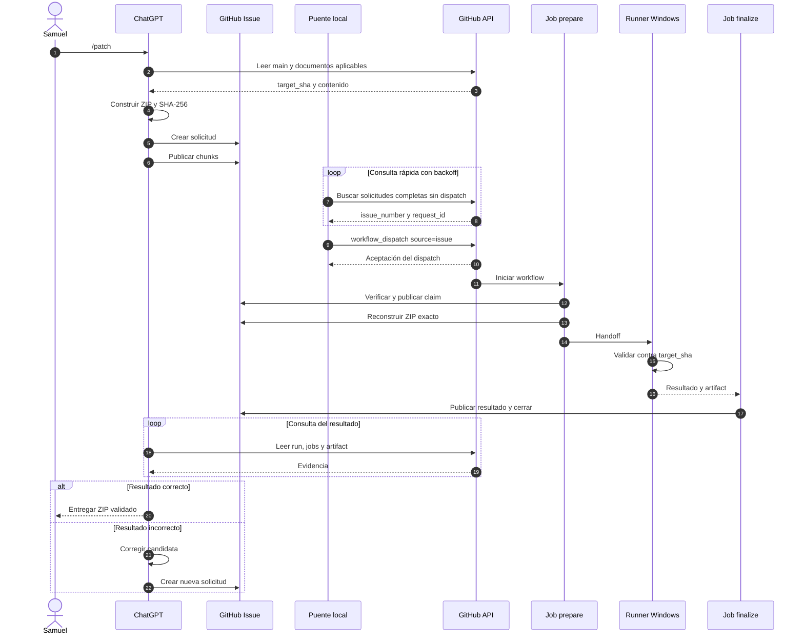

### 7.2. Papel del puente

El puente solo pertenece al plano de control.

Puede:

- consultar issues y comentarios;
- reconocer solicitudes completas;
- deduplicar dispatches;
- invocar el workflow;
- registrar estado técnico local;
- aplicar backoff ante fallos de red.

No puede:

- importar plugins del paquete;
- ejecutar RepoPatcher;
- ejecutar generadores o validadores;
- modificar el checkout local de Mud;
- hacer commit o push de cambios funcionales;
- decidir que un paquete debe incorporarse.

## 8. Motor canónico de validación v7

La lógica hoy embebida en PowerShell dentro del workflow debe extraerse a un único programa:

```text
tooling/repo-patcher-ci/validate_candidate.py
```

Interfaz prevista:

```text
python validate_candidate.py \
    --repo TARGET_REPO \
    --package PACKAGE_ZIP \
    --target-sha SHA \
    --request REQUEST_JSON \
    --output-directory RESULT_DIR \
    [--trust-plugin]
```

### 8.1. Flujo interno

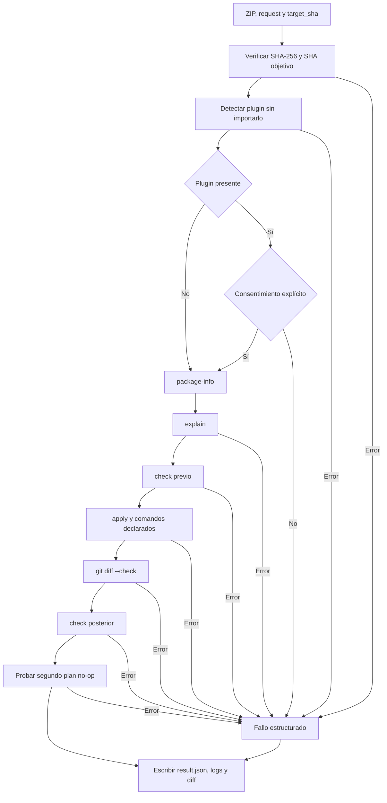

### 8.2. Salidas canónicas

```text
result.json
request.json
validation-metadata.json
validation-transcript.txt
failure-summary.txt
applied.patch
git-diff-binary.patch
git-status.txt
git-diff-stat.txt
```

El workflow, una prueba local u otro orquestador futuro deben consumir las mismas salidas.

## 9. Estados de una solicitud

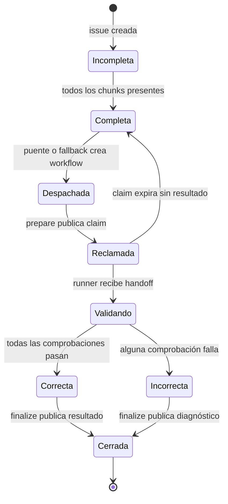

### 9.1. Identidades persistentes

| Identidad | Función |
| --- | --- |
| `request_id` | Distinguir una candidata lógica |
| `issue_number` | Localizar el transporte y su estado |
| `package_sha256` | Identificar exactamente los bytes del ZIP |
| `target_sha` | Identificar exactamente la revisión validada |
| `run_id` | Localizar la ejecución remota |
| `artifact_name` | Localizar la evidencia producida |

## 10. Límites de confianza

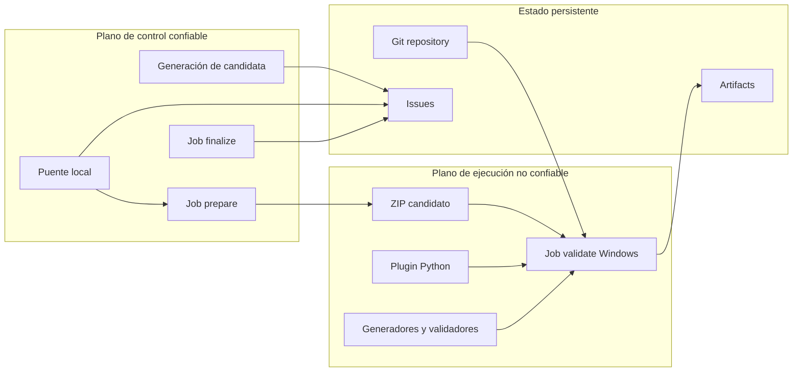

### 10.1. Reglas de seguridad

1. `prepare` y `finalize` pueden escribir en issues, pero no ejecutan código del paquete.
2. `validate` ejecuta código del paquete, pero no recibe permisos de escritura en issues.
3. El puente usa credenciales locales de GitHub, pero no entrega esas credenciales al paquete.
4. El runner usa checkouts separados para el plano de control y el `target_sha`.
5. El plugin se autoriza por candidata, no por autor ni por historial.
6. El ZIP validado se identifica por bytes, no solo por contenido lógico.
7. El checkout usado para validar es temporal y desechable.
8. La aplicación final local puede ejecutar el plugin únicamente después de la aprobación explícita de Samuel y de verificar la identidad del ZIP validado.

## 11. Aplicación y publicación

La validación remota y la incorporación a `main` son operaciones distintas.

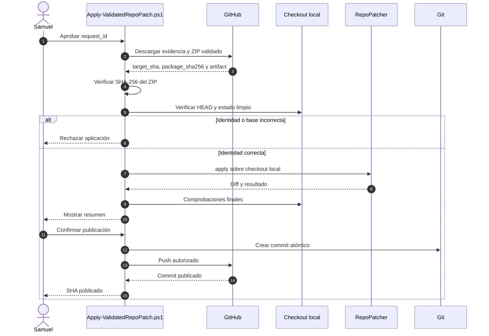

### 11.1. Responsabilidad de la decisión

| Acción | Responsable de decidir | Responsable de ejecutar |
| --- | --- | --- |
| Diseñar candidata | Samuel y ChatGPT | ChatGPT |
| Validar candidata | Política automática | GitHub Actions |
| Corregir candidata fallida | ChatGPT | ChatGPT |
| Aceptar incorporación | Samuel | Samuel |
| Aplicar paquete aceptado | Samuel autoriza | Wrapper local y RepoPatcher |
| Crear commit | Política de commits | Wrapper local o Codex |
| Hacer push | Samuel autoriza | Wrapper local o Codex |

## 12. Matriz de responsabilidades técnicas

| Paso | Componente actual v6 | Componente objetivo v7 | Ejecuta código del paquete |
| --- | --- | --- | ---: |
| Leer el repositorio y las instrucciones | ChatGPT mediante GitHub | Igual | No |
| Construir el ZIP | ChatGPT | Igual | No |
| Codificar para issue | `issue_transport.py encode` o ChatGPT | Igual | No |
| Detectar solicitud | `schedule` + `issue_queue.py` | `bridge.py`; schedule como fallback | No |
| Crear workflow | cron o `Submit-RepoPatch.ps1` | `bridge.py` mediante dispatch | No |
| Reclamar solicitud | `issue_queue.py claim` | `issue_queue.py` adaptado a issue concreta | No |
| Reconstruir ZIP | `issue_transport.py` | Igual | No |
| Detectar plugin | `package_checks.py` | `validate_candidate.py` usando helper | No |
| Validar y aplicar temporalmente | Bloque PowerShell del workflow | `validate_candidate.py` | Sí |
| Publicar resultado | `issue_queue.py finalize` | Igual o adaptado | No |
| Revisar evidencia | ChatGPT | Igual | No |
| Aplicar al checkout real | Manual | Wrapper local futuro | Sí |
| Crear commit | Manual o Codex | Wrapper local futuro | No |
| Push | Manual con autorización | Wrapper local futuro con autorización | No |

## 13. Recuperación y fallos

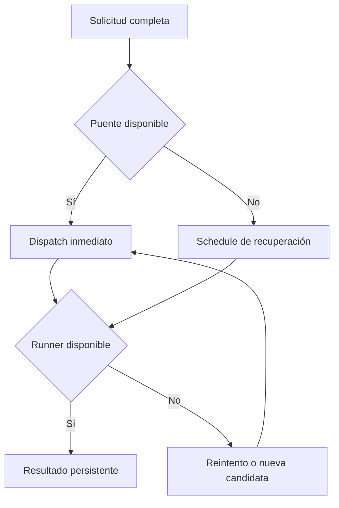

### 13.1. Casos previstos

| Fallo | Comportamiento esperado |
| --- | --- |
| Portátil apagado | La issue permanece; el schedule puede recuperarla y el puente la verá al reanudarse |
| Puente sin red | Backoff; no se ejecuta código del paquete |
| Dispatch duplicado | Claim y resultado persistentes evitan procesado efectivo duplicado |
| Runner no disponible | GitHub mantiene o reintenta el job; la solicitud conserva identidad |
| Claim sin resultado | Puede reclamarse tras el umbral de caducidad |
| ZIP corrupto | Falla antes de ejecutar RepoPatcher |
| Plugin no autorizado | Falla antes de importarlo |
| Validador falla | Se conserva artifact y diagnóstico |
| Aplicación local sobre SHA distinto | El wrapper rechaza la operación |
| ZIP local distinto al validado | El wrapper rechaza la operación |

## 14. Plan de implementación

### Fase 1. Motor independiente

- crear `validate_candidate.py`;
- mover la secuencia de validación fuera del bloque PowerShell;
- mantener las mismas salidas y semántica;
- ejecutar las pruebas actuales contra el motor extraído.

### Fase 2. Dispatch de issue concreta

- ampliar `workflow_dispatch` con `source`, `issue_number` y `request_id`;
- permitir que `prepare` reconstruya una issue concreta;
- conservar la rama portadora como modo manual de diagnóstico;
- conservar el schedule como recuperación.

### Fase 3. Puente local

- crear `bridge.py`;
- implementar consulta condicional, deduplicación y backoff;
- instalar mediante tarea al inicio de sesión;
- registrar estado sin almacenar nuevos secretos;
- demostrar que no ejecuta código del paquete.

### Fase 4. Aplicación validada

- crear `Apply-ValidatedRepoPatch.ps1`;
- verificar `request_id`, `package_sha256`, `target_sha` y estado limpio;
- aplicar mediante RepoPatcher;
- mostrar el diff;
- crear commit conforme a `POLITICA-DE-COMMITS.md`;
- hacer push solo después de autorización explícita.

### Fase 5. Pruebas de aceptación

- declarativo válido;
- plugin rechazado sin consentimiento;
- plugin autorizado;
- ZIP corrupto;
- SHA inexistente;
- paquete no idempotente;
- validador fallido;
- solicitudes simultáneas;
- dispatch duplicado;
- suspensión y reanudación del portátil;
- veinte validaciones consecutivas con medición de latencia.

## 15. Criterios de aceptación v7

La arquitectura v7 no se considerará operativa hasta demostrar:

```text
ninguna modificación del checkout canónico durante validación
ninguna credencial de control visible al código del paquete
ninguna solicitud procesada dos veces de forma efectiva
identidad exacta entre ZIP validado y ZIP entregado
recuperación de solicitudes cuando el puente no está disponible
detección local p95 inferior a 3 segundos
validación total p50 inferior a 45 segundos
validación total p95 inferior a 90 segundos
```

El objetivo de diseño sigue siendo completar habitualmente la validación en menos de un minuto. El umbral p95 inicial permite medir la variabilidad del aprovisionamiento de runners antes de imponer un requisito más estricto.

## 16. Autoridad documental propuesta

La documentación debería dividirse así:

| Documento | Autoridad |
| --- | --- |
| `gobierno/USO-DE-REPO-PATCHER.md` | Formato, semántica y comportamiento del runtime |
| `gobierno/ARQUITECTURA-DE-REPO-PATCHER.md` | Componentes, responsabilidades, flujos, seguridad y estados |
| `tooling/repo-patcher-ci/README.md` | Uso operativo del kit instalado y comandos concretos |
| Tests y workflow | Contrato ejecutable de la implementación |

`USO-DE-REPO-PATCHER.md` debería enlazar este documento, pero no absorber todos sus diagramas. Así se evita mezclar la especificación del motor con una arquitectura de orquestación que puede evolucionar independientemente.
