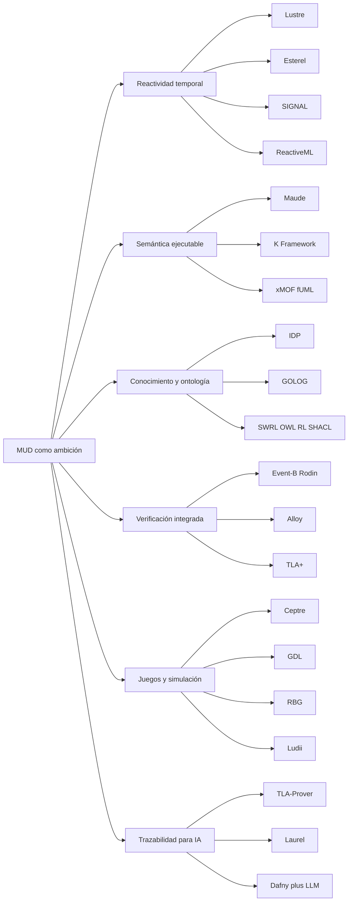
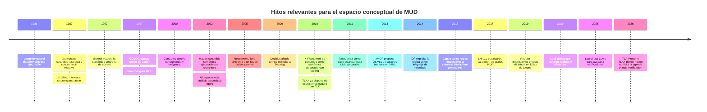

# Academic initiatives associated with the MUD

> [!note] Provenance and reconstruction
> This report was compiled from a draft research document containing internal citation markers without their URLs. On 2 August 2026, those markers were removed and the reference list below was reconstructed using primary publications, specifications and official websites. The exact correspondence of each original marker could not be recovered; therefore, the text should be treated as a general overview rather than as review closed system.

## Executive summary

Taking as a reference the snapshot from the MUD that has As far as I can tell, the project seems to be aiming for a **executable language of domain** where the semantics the problem is the centrepiece, with **reactive rules**, a **operational ontology**, concern about **integrated verification** and a format that is sufficiently structured to provide **traceability useful for automated tools and AI**. In this formulation, MUD is not so much like ‘another programming language’ as it is an attempt to unify, within a single layer, **modelling, implementation, validation y explanation** from the domain.

The main conclusion of the review is clear: **Whilst there are indeed many academic approaches that tackle key aspects of the MUD problem, almost none of them address all of them at once**. The literature is divided between, on the one hand, synchronous reactive languages such as **Lustre, Esterel, SIGNAL and ReactiveML**; on the other hand, frameworks for **semantics executable** such as **Maude** y **K**; as well as ecosystems of **integrated verification** such as **Event-B/Rodin, Alloy and TLA+**; systems for **declarative representation of knowledge** such as **IDP** o **GOLOG**; and DSLs aimed at **games/simulación** such as **Ceptre, GDL, RBG or Ludii**.

That means that MUD **It does not seem like a ‘nice bit of intellectual entertainment’ with no history behind it**, but rather an ambitious recombination of very real and well-studied problems: how to express rules of the domain without burying them in accidental code; how to execute that specification; how to check it; how to separate it semantics and implementation; and how to make it verifiable by both humans and machines. The **potential development** The MUD’s aim would not be to invent a completely new family from scratch, but rather to **integrate** those pieces are better than other works, especially if he really manages to make the artefact itself serve as semantics, runtime, verification base and contract AI-readable. This is a inference based on the revised overview and MUD’s description.

There is also a significant limitation: **I have not come across a standard academic initiative that simultaneously combines ‘wave-based reactive rules’, ‘executable ontology’, ‘built-in model checking’ and ‘a clear separation between semantics from domain "implementation" and "traceability “specific to AI”**. What does emerge, however, is a mosaic of partial yet highly fruitful approaches. Far from being bad news, this absence is precisely what gives a well-defined final-year project the potential to go places.

## What problem do the MUD and its closest allies share?

If I strip MUD down to its underlying design tensions, the issues it shares with literature can be summarised as follows: **the domain wants to speak using his own vocabulary**, but at the same time it must be **executable**, **verifiable**, **reactive** y **analysable**. That is precisely what synchronous languages for reactive systems and frameworks aim to achieve, from different perspectives, semantics executable, declarative knowledge systems and environments for specification formal with automatic verification.

The relation The conceptual relationship between these families can be seen as follows:

The best example of MUD’s application is not found in a single work, but in one **composition**. For ‘wave-reactive rules’, the closest references are the tradition **synchronous/reactiva**; for “semantics from the domain 'separate from the implementation', the closest equivalents are **Maude, K and xMOF/fUML**; for ‘executable ontology’ and multiple inferences, **IDP, GOLOG, SWRL/OWL RL/SHACL**; for “integrated verification”, **Event-B, Alloy and TLA+**; and for “game modelling”/simulación”, **Ceptre, GDL, RBG and Ludii**.

## A comparative overview of relevant initiatives

### Main reference table

| Project or line | Researcher or team | Lead organisation | Objective | Technical approach | State | Reconstructed fountain |
|---|---|---|---|---|---|---|
| Statecharts | David Harel | Weizmann Institute | Modelling complex reactive systems | Visual formalism with hierarchy, convergence and communication | Established and influential | [Article](https://doi.org/10.1016/0167-6423(87)90035-9) |
| Chandelier | Halbwachs, Caspi, Raymond, Pilaud | Verimag / Grenoble | Programming synchronous reactive control | Synchronised declarative dataflow; properties closely related to temporal logic | Implemented and scaled up | [Publication](https://verimag.fr/details.html?lang=en&pub_id=lesar-tse) |
| SIGNAL / Polychrony | Le Guernic et al. | Inria / IRISA | Multi-clock reactive systems | Polychronous synchronous dataflow; associated compiler and verification | Implemented | [Inria](https://radar.inria.fr/rapportsactivite/RA2013/espresso/uid34.html) |
| Esterel | Berry, Gonthier | École des Mines de Paris / Inria Sophia | Reactive control systems | Synchronous imperative language; compilation to software/hardware; semantics constructive | Implemented | [Inria](https://www-sop.inria.fr/esterel.org/files/Html/About/AboutEsterel.htm) |
| ReactiveML | Mandel, Pouzet et al. | Inria Paris / IBM Research | Reaction higher-order synchronous | ML extension with logical instants, synchronous parallelism and efficient compilation | Implemented | [Article](https://doi.org/10.1145/2790449.2790509) |
| Maude | Clavel, Durán, Eker, Martí-Oliet, Meseguer | SRI / UCM Ecosystem | Specification and executable code | Reflexive rewriting logic; modules; strategies; LTL model checking | Implemented | [Official website](https://maude.cs.illinois.edu/) |
| K Framework | Roșu, Șerbănuță et al. | University of Illinois | Defining executable semantics and deriving tools | Rewriting rules using cells; execution, verification and derived tools | Implemented | [Official handbook](https://kframework.org/docs/user_manual/) |
| GOLOG / ConGolog / ElGolog | Levesque, Reiter, Lespérance, De Giacomo et al. | University of Toronto / York / Sapienza | Scheduling actions in dynamic domains | Situation calculus; agent control; history memory in ElGolog | Prototype and academic implementations | [Article](https://doi.org/10.1016/S0743-1066(96)00121-5) |
| Event-B / Rodin | Abrial and the Rodin community | Event-B.org / University of Southampton | Correct development by design | Machines/eventos, refinement, mechanical testing, model-checking plugins and traceability | Implemented | [Documentation](https://wiki.event-b.org/index.php/Main_Page) |
| Alloy | Daniel Jackson | MIT | Explore designs and find counterexamples | Relational logic and fully automated analysis | Implemented | [Official website](https://alloytools.org/about) |
| TLA+ | Leslie Lamport | Microsoft Research | Specify and verify systems, particularly distributed systems | Temporal logic of actions + TLC model checker | Implemented | [Book and materials](https://lamport.azurewebsites.net/tla/book.html) |
| IDP | Denecker, Bogaerts et al. | KU Leuven | Using logic as a modelling language and inference multiple | FO(.)/FO(ID); model expansion, propagation, interactive configuration | Implemented | [Project](https://people.cs.kuleuven.be/~marc.denecker/) |
| Dedalus | Alvaro, Hellerstein et al. | UC Berkeley | Datalog with time for distributed systems | Explicit time, state mutability, asynchrony and temporal stratification | Foundational with prototypes | [Technical report](https://www2.eecs.berkeley.edu/Pubs/TechRpts/2009/EECS-2009-173.html) |
| xMOF + fUML + Alf | Mayerhofer, Langer, Wimmer; OMG | TU Wien / OMG | Executable DSLs with semantics modelled | Semantics behavioural model of fUML and the Alf textual syntax | Standard-based prototype | [xMOF](https://doi.org/10.1007/978-3-319-02654-1_4) |
| SWRL / OWL 2 RL / SHACL | Horrocks et al.; W3C | W3C / Semantic Web community | Rules, inference y validation about RDF/OWL | Rules type Horn, profiles rule-based, validation graph closure | Standards implemented | [W3C](https://www.w3.org/TR/shacl/) |
| Sceptre | Chris Martens | Carnegie Mellon University | Prototyping generative interactive systems | Rules inspired by linear logic for games, storytelling and simulation | Academic prototype | [Article](https://doi.org/10.1609/aiide.v11i1.12784) |
| GDL-II / GDL-III | Michael Thielscher | UNSW | Describe arbitrary games for GGP | Declarative formalism of game rules, imperfect information and epistemicity | Used in research | [GDL-III](https://doi.org/10.24963/ijcai.2017/177) |
| Standard Board Games | Kowalski, Mika, Sutowicz, Szykuła | University of Wrocław | An efficient and natural GDL for board games | Regular languages and an efficient forward model | Implemented | [Article](https://doi.org/10.1609/aaai.v33i01.33011699) |
| Ludii | Piette, Soemers, Browne et al. | Maastricht University | A comprehensive and efficient overall gaming system | High-level games, implementation and empirical comparison | Implemented | [Article](https://doi.org/10.3233/FAIA200120) |

### An analytical summary of the works most closely related to MUD

**Statecharts** He introduced an idea that remains central: complex reactive behaviour requires a notation with **hierarchy, concurrence and communication** rather than flat states. It is related to MUD because it shows how a semantics from domain It can be preserved in a relatively readable representation, although it is geared more towards control than towards ontology or integrated verification.

**Chandelier** It is very important because it converts logical time and the reaction It is a matter of language, not an implementation detail. Its similarity to MUD lies in the fact that **the model from the domain and the performance share a formalistic approach**, and it also paved the way for expressing properties within the same ecosystem.

**SIGNAL** It relates particularly closely to the idea of ‘waves’ or different rhythms because it works with **multiple watches** and polychronous specifications. If MUD wants non-uniform reactive rules, SIGNAL is essential reading: it explains how to handle partial synchronisation without losing declarativeness.

**Esterel** represents the most control-oriented version of the synchronic tradition. Its relation with MUD is not in the ontology, but in the **clarity semantics of the moments** and on the idea that a reactive language can be both executable and amenable to formal reasoning.

**ReactiveML** extend that world reactive towards richer data structures and more ‘high-level’ programming. For MUD, this is very important: it suggests that there is no need to choose between formal reactivity and practical expressiveness.

**Maude** It is probably one of the most striking comparisons. It suggests that the semantics even if it is **executable** using rewriting rules, and on that basis adds reflection, strategies and model checking. It resembles MUD in its ambition to make the boundary between ‘specifying’ and ‘implementing’ much more blurred.

**K Framework** takes that intuition even further: starting from a semantics Interpreters and verifiers are formally derived. For MUD, K is a key reference point if the central thesis is that **the semantics from domain should generate tooling** and not just remain as mere documentation.

**GOLOG, ConGolog and ElGolog** are very similar in another respect: that of depicting dynamic worlds rich in action, story and choices. Their point Its strength lies not in general-purpose model checking, but in the **implementation of theories of action**; that is why they are of interest to MUD if the ontology is to be truly operational and not merely taxonomic.

**Event-B/Rodin** offers a different lesson: how to structure a project into levels of abstraction by means of **refinement** and force them to justify its correctness. It is linked to MUD because it directly addresses the distinction between model concept and production, with traceability formally between layers.

**Alloy** it is not a runtime for domain, but it is an outstanding example of **immediate automated analysis** on compact specifications. For MUD, it is less model operational and more model ‘rapid formal feedback’: a hugely powerful idea for validating rules of domain before running them.

**TLA+** It is crucial if the MUD wishes to address issues of security, progress and overall temporal behaviour. The key lesson is that the specification It may be relatively close to human reasoning and, at the same time, be contrasted with an industrialisable model checker such as TLC.

**IDP** is perhaps the clearest example of the idea of **executable ontology** understood as a ‘declarative base with multiple forms of inference”. It is very much in the spirit of MUD: the theory is not a procedural programme, but a description of the domain reusable by different inference engines.

**Dedalus** shows how to enter **explicit time** and asynchrony in Datalog without straying from the declarative realm. If MUD requires reactive rules with memory and incremental evolution, Dedalus is a very strong contender to ensure the temporal dimension is not poorly re-engineered.

**xMOF, fUML and Alf** they tackle the question head-on: “Can a semantics language of domain “to live within standard models and still remain executable?”. For MUD, they are essential because they show how to separate **abstract syntax**, **behavioural semantics** and tooling.

**SWRL, OWL 2 RL and SHACL** cover the ontology-rules-triangle-validation. They are not a complete substitute for MUDs because they tend to fall short in terms of complex dynamics or temporal reactivity, but they are essential for understanding what it means to have an ontology with inference and with verifiable restrictions.

**Sceptre** is an excellent resource for the ‘simulation’ aspect/juego”. Its merit lies in expressing mechanics and progression through rules that can **to be inspected, cleaned and played**. For MUD, this is relevant if one of its natural outputs is microworlds or simulable board games.

**GDL-II/GDL-III, RBG and Ludii** show three different ways of creating languages for domain for general-purpose games. They are important for MUDs because they demonstrate that a DSL for rules can aspire to **generality, efficiency and readability** At the same time, although each person prioritises a different combination of those three things.

## Key overlaps and differences compared with the MUD

### Where is there the greatest overlap?

The greatest overlap with the MUD is found in four areas. The first is the **temporary reactivity**, dominated by Lustre, Esterel, SIGNAL and ReactiveML. The second is the **semantics tool deriver executable**, where Maude and K are particularly strong. The third is the **declarative description of the domain with multiple inferences**, notably IDP and, in a different vein, GOLOG. The fourth is the **integrated or quasi-integrated verification**, where Event-B, Alloy and TLA+ are the obvious benchmarks.

### Where the MUD seems different

The most obvious difference is that MUD, as you describe it, does not seem to want merely a reactive language, nor merely a formal modeller, nor merely an ontology with rules. It seems to want a **unique artefact** to act as **language of the domain**, **runtime**, **space for validation**, **simulation support** y **area of traceability for AI**. That exact combination does not appear in a consolidated form in the material reviewed.

### Map of overlapping areas

| Area | What literature has to offer | What would the MUD be missing if it were to follow only that path? | Value for MUD |
|---|---|---|---|
| Dependent types | Idris and F* they provide very strong assurances in terms of programmes and specifications | They tend to require greater formal expertise and do not resolve ontology on their own/reactividad from domain | High for fine details, medium for ergonomics of domain |
| Datalog / declarative logic | IDP, Dedalus, Datafun and similar organisations provide inference, fixed points and, sometimes, explicit time | Less naturalness for rich operational semantics or complex interactive simulation | Far too high for operational ontology and inference incremental |
| FRP and synchronous reactivity | Fran and ReactiveML model time, events and reactive evolution with great elegance | Verification and ontology are often left out or only partially integrated | Stop if ‘waves’ and temporal causality are fundamental |
| Event sourcing | Provides immutable traces, replay and observability | It doesn’t usually contribute semantics no formal or robust built-in verification | A sort of layer of traceability, ‘low’ as the semantic core |
| Model checking | Alloy, TLA+, Maude and Rodin plugins provide counterexamples and automatic exploration | The price is usually modelled as an additional factor or a constraint on expressiveness | A very high hurdle if the MUD wants a purge semantics early |
| Executable ontologies | SWRL, OWL RL, SHACL and Event-B+ ontologies enable inference/validación on knowledge | The temporal dynamics and rich performance are more limited | Stop if the MUD wants to be contract interoperable semantic | |
| DSLs for gaming and simulation | Ceptre, GDL, RBG and Ludii provide excellent testbeds for rules and states | They don’t always separate semantics in-depth and as the MUD would like it to be implemented | Highly significant as a test bed and demonstration site for value |

In my view, the combination **IDP + Dedalus + Maude/K + Event-B/TLA+ + Ludii/Ceptre** It describes the ‘MUD space’ quite well. Not because MUD must resemble any of those systems exactly, but because almost all of its difficult problems are found there: declarative representation, time, execution, testing, counterexamples and simulation. This synthesis is inferential, but it is supported by the families under comparison.

### Timeline of key milestones

Developments in recent years suggest something else important: the **traceability for AI** It is still an emerging field and is usually built today **on top of** of existing formal languages, not within a language of domain new. In that sense, the MUD could arrive ‘ahead of schedule’ at a convergence that the literature is only just beginning to explore.

## Recommended priority reading and possible topics for the final-year project

### Books I would prioritise

**Maude + K Framework.** If the MUD’s main strategy is that the semantics if it is executable and generates tooling, here is the more structural overview. Maude provides the rewriting logic and K the practical approach to deriving analysers, interpreters and verifiers from a semantics formally.

**Lustre + SIGNAL + Esterel + ReactiveML.** If ‘wave-reactive rules’ are a central insight, this family teaches us almost everything of importance about logical time, clocks, synchrony, causality and reactive compositionality. There is a great deal of well-refined knowledge here.

**IDP + Dedalus.** If the MUD wants a truly executable ontology rather than just a schema, this pair is very instructive: IDP for the idea of a declarative theory with multiple inferences, and Dedalus for the explicit inclusion of time and evolution.

**Event-B/Rodin + TLA+ + Alloy.** This triad does not define “a runtime for domain” in the sense of MUD, but it does show how to incorporate testing, model checking and counterexamples into the design process. For a serious final-year project, at least a comparison with these tools would be almost essential.

**xMOF / fUML / Alf.** If the question is how to formally separate the semantics from the domain Regarding a specific implementation without compromising on executability, here are some very relevant answers from MDE and DSL Engineering.

**Ceptre + Ludii or RBG.** If Samuel wants to demonstrate MUD using something tangible and measurable, the field of board games or discrete simulations is ideal: states, rules, reactivity, traces, explainability and objective comparison between descriptions.

### Three possible topics for the final-year project

**A minimal MUD core with semantics executable and verification of scope delimited.**
Topic: defining a small subset of MUD and assigning it a semantics An executable file in Maude or K. Deliverables: interpreter, execution traces and verification of safety properties, or reachability. Value academic: to demonstrate whether MUD can be “semantics “first” without becoming bogged down in unintended complexity.

**MUD as a reactive-temporal language for domain compared with face-to-face teaching.**
Topic: Formalising MUD ‘waves’ and comparing them with logical instants, clocks and Lustre’s polychrony/SIGNAL/ReactiveML. Deliverable: semantics small-scale operational implementation, reproducible examples and a comparison of expressiveness for discrete domains. Value academic: to rigorously pinpoint the true novelty of MUD in terms of timing and responsiveness.

**MUD as a DSL for games/simulación with traceability for AI.**
Topic: modelling several simple games in MUD and comparing them with Ceptre, RBG or Ludii. Deliverable: a corpus of models, conciseness metrics, traceability changes, automatic status explanations/reglas and perhaps translation into an auxiliary representation for LLMs. Value Academic: a clear and highly defensible empirical assessment in a final-year project.

### Criteria for determining whether an initiative is applicable to MUD

| Criterion | A question worth asking |
|---|---|
| Compatibility semantics | Can it represent entities of domain, collections, temporality and reactive shots without artificial coding? |
| Scalability | Is the model Does it remain executable and analysable as the number of rules, states and traces increases? |
| Tools | Are there parsers, editors, simulators, verifiers, counterexamples, debugging tools and performance profiles? |
| Community and maturity | Is there a critical mass of publications, examples, maintenance and technical discussion? |
| Licensing and interoperability | Can it be used for a final-year project or an open-source prototype? Does it allow integration with other runtimes, standards or exporters? |
| Traceability for AI | Is the semantics Is it stable, serialisable, explainable and capable of producing verifiable evidence or repair loops? |

Applying those criteria, my overall assessment is as follows: **Maude/K** score very highly in semantics executable; **Event-B/TLA+/Alloy** score very highly in verification; **IDP/Dedalus** very high in inferential expressiveness; **Chandelier/SIGNAL/ReactiveML** very high in terms of temporal reactivity; **Sceptre/Ludii/RBG** very high as an experimental rule-based system; and **SWRL/OWL RL/SHACL** very high in terms of interoperability semantics structured. What is still missing in almost all of them is the complete combination within a single design.

## Final assessment of the MUD’s academic record

My assessment, based on the available evidence, is favourable, but subject to one key condition: scope. **There is indeed a serious problem underlying this**: the overlap between declarative modelling, reactivity, operational ontology, verification and traceability. **There are places available for the final-year project**: in fact, precisely because literature is fragmented. But MUD’s academic approach will not be to present ‘the total language’ all at once, but rather to **choose a passage**, compare it with one or two neighbouring families, and formalise its semantics and assess whether it offers a clear improvement in one of the following areas: expressiveness of the domain, clarity semantics, ease of verification, or traceability for automation/IA.

There are still two areas where information remains insufficient. Firstly, I have not yet seen a specification a sufficiently mature public stance on the part of the MUD to formally compare its semantics such as, for example, that of Dedalus or K. Secondly, I have not come across any primary literature that uses precisely the concept of **“wave-reactive rules”** under that name; the closest equivalents are synchronous tradition, polychrony and certain reactive models involving multiple time scales. It is important to view this gap honestly: it is an opportunity for originality, but also a sign that any final-year project will need to **define very precisely** What does “wave” in MUD.

## Reconstructed primary and official sources

### Reactivity and time

- David Harel, [“Statecharts: A Visual Formalism” for “Complex Systems”](https://doi.org/10.1016/0167-6423(87)90035-9), *The Science of Computer Programming*, 1987.
- Halbwachs, Lagnier and Ratel, [“Programming and Verifying Critical Systems by “Means of the Lustre Synchronous Data-Flow Programming Language”](https://verimag.fr/details.html?lang=en&pub_id=lesar-tse), 1992.
- Inria, [Polychrony toolset: functionality and documentation/Signal](https://radar.inria.fr/rapportsactivite/RA2013/espresso/uid34.html).
- Inria, [presentation, semantics and Esterel tools](https://www-sop.inria.fr/esterel.org/files/Html/About/AboutEsterel.htm).
- Mandel, Pasteur and Pouzet, [“ReactiveML, Ten Years On”](https://doi.org/10.1145/2790449.2790509), PPDP 2015.
- Alvaro et al., [“Dedalus: Datalog in Time and "Space"](https://www2.eecs.berkeley.edu/Pubs/TechRpts/2009/EECS-2009-173.html), UC Berkeley, 2009.
- Idris, [website and official documentation](https://idris-lang.org/).
- F*, [official website and bibliography](https://fstar-lang.org/).

### Semantics executable, actions and modelling

- Maude Team, [Maude’s website, manual and official publications](https://maude.cs.illinois.edu/).
- K Framework, [official framework manual semantics executable](https://kframework.org/docs/user_manual/).
- Levesque et al., [“GOLOG: A Logic Programming Language” for “Dynamic Domains”](https://doi.org/10.1016/S0743-1066(96)00121-5), 1997.
- Cognitive Robotics Group, University of Toronto, [GOLOG’s official archive](https://www.cs.toronto.edu/~fritz/golog/).
- Mayerhofer et al., [“xMOF: Executable DSMLs Based on on “fUML”](https://doi.org/10.1007/978-3-319-02654-1_4), SLE 2013.
- Object Management Group, [Foundational UML — fUML 1.5](https://www.omg.org/spec/FUML/).
- Marc Denecker, [IDP and FO(.)](https://people.cs.kuleuven.be/~marc.denecker/).
- Arntzenius and Krishnaswami, [“Datafun: a Functional Datalog”](https://doi.org/10.1145/3022670.2951948), ICFP 2016.

### Verification and knowledge

- Event-B/Rodin, [official documentation](https://wiki.event-b.org/index.php/Main_Page).
- Daniel Jackson and Alloy Team, [Alloy’s official website](https://alloytools.org/about).
- Daniel Jackson, [“Alloy: A Language and Tool for “Exploring Software Designs”](https://doi.org/10.1145/3338843), 2019.
- Leslie Lamport, [*Specifying Systems* and official TLA+ materials](https://lamport.azurewebsites.net/tla/book.html).
- Yu, Manolios and Lamport, [“Model Checking TLA+ Specifications”](https://lamport.org/pubs/yuanyu-model-checking.pdf).
- W3C, [OWL 2 Profiles, including OWL 2 RL](https://www.w3.org/TR/owl2-profiles/).
- W3C, [SWRL](https://www.w3.org/submissions/SWRL/).
- W3C, [Shapes Constraint Language — SHACL](https://www.w3.org/TR/shacl/).

### Games and simulation

- Chris Martens, [“Ceptre: A Language for “Modelling Generative Interactive Systems”](https://doi.org/10.1609/aiide.v11i1.12784), AIIDE 2015.
- Michael Thielscher, [“A General Game Description Language” for “Incomplete Information Games”](https://cgi.cse.unsw.edu.au/~mit/Papers/AAAI10a.pdf), 2010.
- Michael Thielscher, [“GDL-III: A Description Language for “Epistemic General Game Playing”](https://doi.org/10.24963/ijcai.2017/177), IJCAI 2017.
- Kowalski et al., [“Regular Board Games”](https://doi.org/10.1609/aaai.v33i01.33011699), AAAI 2019.
- Piette et al., [“Ludii — The Ludemic General Game System”](https://doi.org/10.3233/FAIA200120), ECAI 2020.
- Digital Ludeme Project, [official website](https://ludeme.eu/).

### AI and verification support

- Mugnier et al., [“Laurel: Generating Dafny Assertions Using Large Language Models”](https://arxiv.org/abs/2405.16792), 2024.
- Poetry, Loughridge and Amin, [“dafny-annotator: AI-Assisted Verification of Dafny Programmes”](https://arxiv.org/abs/2411.15143), 2024.
- [“TLA-Prover: Verifiable TLA+ Specification Synthesis”](https://arxiv.org/abs/2606.06133), 2026.
- [“TLA+-Bench: An Execution-Grounded Benchmark”](https://arxiv.org/abs/2607.23425), 2026.

These sources underpin the report’s main findings and comparisons. The claims regarding a total absence of jobs equivalent to those in the MUD and the specific recommendations made by TFG remain summaries and inferences drawn from the report, not findings demonstrated by a single publication.

