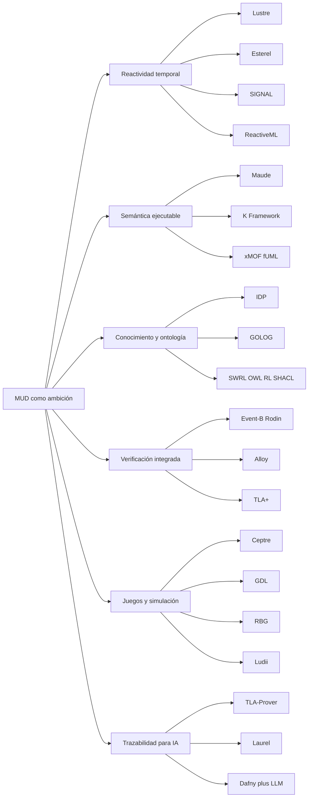
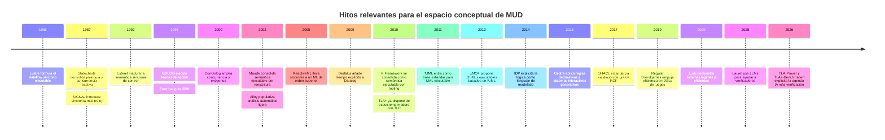

# Iniciativas académicas afines a MUD

> [!note] Procedencia y reconstrucción
> Este informe se conservó a partir de un borrador de investigación que contenía marcadores internos de citas sin sus URL. El 2 de agosto de 2026 se retiraron esos marcadores y se reconstruyó la bibliografía inferior con publicaciones primarias, especificaciones y sitios oficiales. La correspondencia exacta de cada marcador original no era recuperable; por ello, el texto debe tratarse como panorama orientativo y no como revisión sistemática cerrada.

## Resumen ejecutivo

Tomando como referencia la instantánea de MUD que has compartido, el proyecto parece aspirar a un **lenguaje ejecutable de dominio** donde la semántica del problema sea la pieza central, con **reglas reactivas**, una **ontología operativa**, preocupación por **verificación integrada** y un formato suficientemente estructurado como para ofrecer **trazabilidad útil a herramientas automáticas e IA**. En esa formulación, MUD no se parece tanto a “otro lenguaje de programación” como a un intento de unificar, en una sola capa, **modelado, ejecución, validación y explicación** del dominio.

La conclusión principal de la revisión es clara: **sí existen muchas líneas académicas que atacan partes importantes del problema de MUD, pero casi ninguna reúne todas a la vez**. La literatura está fragmentada entre, por un lado, lenguajes reactivos síncronos como **Lustre, Esterel, SIGNAL y ReactiveML**; por otro, marcos de **semántica ejecutable** como **Maude** y **K**; además de ecosistemas de **verificación integrada** como **Event-B/Rodin, Alloy y TLA+**; sistemas de **representación declarativa del conocimiento** como **IDP** o **GOLOG**; y DSLs orientados a **juegos/simulación** como **Ceptre, GDL, RBG o Ludii**.

Eso significa que MUD **no parece un “bonito entretenimiento intelectual” sin genealogía**, sino una recombinación ambiciosa de problemas muy reales y muy estudiados: cómo expresar reglas del dominio sin enterrarlas en código accidental; cómo ejecutar esa especificación; cómo verificarla; cómo separar semántica e implementación; y cómo hacerla inspeccionable por humanos y máquinas. La **novedad potencial** de MUD no estaría en inventar de cero una familia inédita, sino en **integrar** mejor que otros trabajos esas piezas, sobre todo si de verdad logra que el mismo artefacto sirva como semántica, runtime, base de verificación y contrato legible para IA. Esto es una inferencia apoyada en el panorama revisado y en la descripción de MUD.

También hay una limitación importante: **no he encontrado una iniciativa académica canónica que combine simultáneamente “reglas reactivas por ondas”, “ontología ejecutable”, “model checking incorporado”, “separación limpia entre semántica de dominio e implementación” y “trazabilidad específica para IA”**. Lo que sí aparece es un mosaico de acercamientos parciales y muy fértiles. Esa ausencia, lejos de ser mala noticia, es precisamente lo que hace que un TFG bien acotado pueda tener recorrido.

## Qué problema comparten MUD y las iniciativas más cercanas

Si abstraigo MUD a sus tensiones de diseño, la problemática compartida con la literatura se puede resumir así: **el dominio quiere hablar con su propio vocabulario**, pero al mismo tiempo debe ser **ejecutable**, **verificable**, **reactivo** y **analizable**. Eso es exactamente lo que persiguen, desde ángulos distintos, los lenguajes síncronos para sistemas reactivos, los marcos de semántica ejecutable, los sistemas de conocimiento declarativo y los entornos de especificación formal con comprobación automática.

La relación conceptual entre esas familias puede verse así:

El mejor encaje con MUD no está en una sola obra, sino en una **composición**. Para “reglas reactivas por ondas”, las referencias más cercanas son la tradición **síncrona/reactiva**; para “semántica del dominio separada de la implementación”, lo más cercano son **Maude, K y xMOF/fUML**; para “ontología ejecutable” y múltiples inferencias, **IDP, GOLOG, SWRL/OWL RL/SHACL**; para “verificación integrada”, **Event-B, Alloy y TLA+**; y para “modelado de juegos/simulación”, **Ceptre, GDL, RBG y Ludii**.

## Panorama comparativo de iniciativas relevantes

### Tabla de referencia principal

| Proyecto o línea | Investigador o equipo | Institución principal | Objetivo | Enfoque técnico | Estado | Fuente reconstruida |
|---|---|---|---|---|---|---|
| Statecharts | David Harel | Weizmann Institute | Modelar sistemas reactivos complejos | Formalismo visual con jerarquía, concurrencia y comunicación | Implementado e influyente | [Artículo](https://doi.org/10.1016/0167-6423(87)90035-9) |
| Lustre | Halbwachs, Caspi, Raymond, Pilaud | Verimag / Grenoble | Programar control reactivo síncrono | Dataflow declarativo sincronizado; propiedades cercanas a lógica temporal | Implementado e industrializado | [Publicación](https://verimag.fr/details.html?lang=en&pub_id=lesar-tse) |
| SIGNAL / Polychrony | Le Guernic y col. | Inria / IRISA | Sistemas reactivos multirreloj | Dataflow síncrono policrónico; compilador y verificación asociados | Implementado | [Inria](https://radar.inria.fr/rapportsactivite/RA2013/espresso/uid34.html) |
| Esterel | Berry, Gonthier | École des Mines de Paris / Inria Sophia | Sistemas reactivos de control | Lenguaje síncrono imperativo; compilación a software/hardware; semántica constructiva | Implementado | [Inria](https://www-sop.inria.fr/esterel.org/files/Html/About/AboutEsterel.htm) |
| ReactiveML | Mandel, Pouzet y col. | Inria Paris / IBM Research | Reacción síncrona de orden superior | Extensión ML con instantes lógicos, paralelismo síncrono y compilación eficiente | Implementado | [Artículo](https://doi.org/10.1145/2790449.2790509) |
| Maude | Clavel, Durán, Eker, Martí-Oliet, Meseguer | Ecosistema SRI / UCM | Especificación y programación ejecutable | Rewriting logic reflexiva; módulos; estrategias; model checking LTL | Implementado | [Sitio oficial](https://maude.cs.illinois.edu/) |
| K Framework | Roșu, Șerbănuță y col. | University of Illinois | Definir semánticas ejecutables y derivar herramientas | Reglas de reescritura con celdas; ejecución, verificación y herramientas derivadas | Implementado | [Manual oficial](https://kframework.org/docs/user_manual/) |
| GOLOG / ConGolog / ElGolog | Levesque, Reiter, Lespérance, De Giacomo y col. | Univ. of Toronto / York / Sapienza | Programación de acciones en dominios dinámicos | Situation calculus; control de agentes; memoria de historia en ElGolog | Prototipo e implementaciones académicas | [Artículo](https://doi.org/10.1016/S0743-1066(96)00121-5) |
| Event-B / Rodin | Abrial y comunidad Rodin | Event-B.org / University of Southampton | Desarrollo correcto por construcción | Máquinas/eventos, refinamiento, prueba mecánica, plugins de model checking y trazabilidad | Implementado | [Documentación](https://wiki.event-b.org/index.php/Main_Page) |
| Alloy | Daniel Jackson | MIT | Explorar diseños y encontrar contraejemplos | Lógica relacional y análisis totalmente automático | Implementado | [Sitio oficial](https://alloytools.org/about) |
| TLA+ | Leslie Lamport | Microsoft Research | Especificar y verificar sistemas, sobre todo distribuidos | Lógica temporal de acciones + TLC model checker | Implementado | [Libro y materiales](https://lamport.azurewebsites.net/tla/book.html) |
| IDP | Denecker, Bogaerts y col. | KU Leuven | Usar la lógica como lenguaje de modelado e inferencia múltiple | FO(.)/FO(ID); expansión de modelos, propagación, configuración interactiva | Implementado | [Proyecto](https://people.cs.kuleuven.be/~marc.denecker/) |
| Dedalus | Alvaro, Hellerstein y col. | UC Berkeley | Datalog con tiempo para sistemas distribuidos | Tiempo explícito, estado mutable, asincronía y estratificación temporal | Fundacional con prototipos | [Informe técnico](https://www2.eecs.berkeley.edu/Pubs/TechRpts/2009/EECS-2009-173.html) |
| xMOF + fUML + Alf | Mayerhofer, Langer, Wimmer; OMG | TU Wien / OMG | DSLs ejecutables con semántica modelada | Semántica conductual sobre fUML y sintaxis textual Alf | Prototipo apoyado en estándar | [xMOF](https://doi.org/10.1007/978-3-319-02654-1_4) |
| SWRL / OWL 2 RL / SHACL | Horrocks y col.; W3C | W3C / comunidad Semantic Web | Reglas, inferencia y validación sobre RDF/OWL | Reglas tipo Horn, perfiles rule-based, validación cerrada de grafos | Estándares implementados | [W3C](https://www.w3.org/TR/shacl/) |
| Ceptre | Chris Martens | Carnegie Mellon University | Prototipar sistemas interactivos generativos | Reglas inspiradas en lógica lineal para juego, narrativa y simulación | Prototipo académico | [Artículo](https://doi.org/10.1609/aiide.v11i1.12784) |
| GDL-II / GDL-III | Michael Thielscher | UNSW | Describir juegos arbitrarios para GGP | Formalismo declarativo de reglas de juego, información imperfecta y epistemicidad | Implementado en investigación | [GDL-III](https://doi.org/10.24963/ijcai.2017/177) |
| Regular Boardgames | Kowalski, Mika, Sutowicz, Szykuła | Univ. of Wrocław | GDL eficiente y natural para juegos de tablero | Lenguajes regulares y forward model eficiente | Implementado | [Artículo](https://doi.org/10.1609/aaai.v33i01.33011699) |
| Ludii | Piette, Soemers, Browne y col. | Maastricht University | Sistema general de juegos comprensible y eficiente | Ludemes de alto nivel, ejecución y comparación empírica | Implementado | [Artículo](https://doi.org/10.3233/FAIA200120) |

### Síntesis analítica de los trabajos más cercanos a MUD

**Statecharts** introdujo una idea que sigue siendo central: el comportamiento reactivo complejo necesita una notación con **jerarquía, concurrencia y comunicación** en lugar de estados planos. Se relaciona con MUD porque muestra cómo una semántica de dominio puede preservarse en una representación relativamente legible, aunque está más orientado a control que a ontología o verificación integrada.

**Lustre** es muy relevante porque convierte el tiempo lógico y la reacción continua en parte del lenguaje, no en un detalle de implementación. Su cercanía con MUD está en que **el modelo del dominio y la ejecución comparten formalismo**, y además abrió la puerta a expresar propiedades dentro del mismo ecosistema.

**SIGNAL** se acerca especialmente a la idea de “ondas” o ritmos distintos porque trabaja con **múltiples relojes** y especificaciones policrónicas. Si MUD quiere reglas reactivas no uniformes, SIGNAL es una lectura prioritaria: enseña cómo tratar sincronización parcial sin perder declaratividad.

**Esterel** representa la versión más control-dominada de la tradición síncrona. Su relación con MUD no está en la ontología, sino en la **claridad semántica de los instantes** y en la idea de que un lenguaje reactivo puede ser a la vez ejecutable y susceptible de razonamiento formal.

**ReactiveML** extiende ese mundo reactivo hacia estructuras de datos más ricas y una programación más “de alto nivel”. Para MUD esto importa mucho: sugiere que no hay por qué elegir entre reactividad formal y expresividad práctica.

**Maude** es probablemente una de las comparaciones más fuertes. Propone que la semántica misma sea **ejecutable** mediante reglas de reescritura, y sobre esa base añade reflexión, estrategias y model checking. Se parece a MUD en la ambición de que la frontera entre “especificar” e “implementar” sea mucho más delgada.

**K Framework** lleva esa intuición todavía más lejos: desde una semántica formal se derivan intérpretes y verificadores. Para MUD, K es una referencia clave si la tesis central es que **la semántica de dominio debería generar tooling** y no quedarse como mera documentación.

**GOLOG, ConGolog y ElGolog** son muy cercanos en otro eje: el de representar dominios dinámicos ricos con acciones, historia y decisiones. Su punto fuerte no es el model checking generalista, sino la **ejecución de teorías de acción**; por eso interesan a MUD si la ontología debe ser verdaderamente operativa y no sólo taxonómica.

**Event-B/Rodin** ofrece una lección distinta: cómo estructurar un proyecto en niveles de abstracción mediante **refinamiento** y obligar a justificar su corrección. Se relaciona con MUD porque aborda directamente la separación entre modelo conceptual y realización, con trazabilidad formal entre capas.

**Alloy** no es un runtime de dominio, pero sí un ejemplo sobresaliente de **análisis automático inmediato** sobre especificaciones compactas. Para MUD es menos modelo operativo y más modelo de “feedback formal rápido”: una idea potentísima para validar reglas de dominio antes de ejecutarlas.

**TLA+** es decisivo si MUD quiere entrar en propiedades de seguridad, progreso y comportamiento temporal global. Su gran lección es que la especificación puede ser relativamente cercana al razonamiento humano y, al mismo tiempo, contrastarse con un model checker industrializable como TLC.

**IDP** es quizá la referencia más clara para la idea de **ontología ejecutable** entendida como “base declarativa con múltiples formas de inferencia”. Se acerca mucho a MUD en espíritu: la teoría no es un programa procedimental, sino una descripción del dominio reutilizable por distintos motores inferenciales.

**Dedalus** demuestra cómo introducir **tiempo explícito** y asincronía en Datalog sin salir del terreno declarativo. Si MUD quiere reglas reactivas con memoria y evolución incremental, Dedalus es una referencia muy seria para no reinventar mal la dimensión temporal.

**xMOF, fUML y Alf** atacan frontalmente la pregunta: “¿puede una semántica de lenguaje de dominio vivir en modelos estándar y seguir siendo ejecutable?”. Para MUD son esenciales porque muestran cómo separar **abstract syntax**, **behavioral semantics** y tooling.

**SWRL, OWL 2 RL y SHACL** cubren el triángulo ontología-reglas-validación. No son un sustituto completo de MUD porque suelen quedar cortos en dinámica compleja o reactividad temporal, pero son fundamentales para entender qué significa tener una ontología con inferencia y con restricciones verificables.

**Ceptre** es una referencia excelente para el lado “simulación/juego”. Su mérito está en expresar mecánicas y evolución con reglas que pueden **inspeccionarse, depurarse y jugarse**. Para MUD, esto es relevante si una de sus salidas naturales son microworlds o juegos de mesa simulables.

**GDL-II/GDL-III, RBG y Ludii** muestran tres maneras distintas de crear lenguajes de dominio para juegos con vocación general. Son importantes para MUD porque prueban que un DSL de reglas puede aspirar a **generalidad, eficiencia y legibilidad** a la vez, aunque cada uno privilegia una combinación distinta de esas tres cosas.

## Solapamientos y diferencias clave frente a MUD

### Dónde hay mayor solapamiento

El mayor solapamiento con MUD aparece en cuatro zonas. La primera es la **reactividad temporal**, dominada por Lustre, Esterel, SIGNAL y ReactiveML. La segunda es la **semántica ejecutable derivadora de herramientas**, donde Maude y K son especialmente fuertes. La tercera es la **descripción declarativa del dominio con inferencias múltiples**, donde destacan IDP y, en clave distinta, GOLOG. La cuarta es la **verificación integrada o casi integrada**, donde Event-B, Alloy y TLA+ son la referencia evidente.

### Dónde MUD parece diferente

La diferencia más clara es que MUD, tal como lo describes, no parece querer sólo un lenguaje reactivo, ni sólo un modelador formal, ni sólo una ontología con reglas. Parece querer un **artefacto único** que haga de **lenguaje del dominio**, **runtime**, **espacio de validación**, **soporte para simulación** y **superficie de trazabilidad para IA**. Esa combinación exacta no aparece de forma consolidada en lo revisado.

### Mapa de áreas de solapamiento

| Área | Qué ofrece la literatura | Qué le faltaría a MUD si copiara sólo esa vía | Valor para MUD |
|---|---|---|---|
| Tipos dependientes | Idris y F* dan garantías muy fuertes a nivel de programas y especificaciones | Suelen exigir más pericia formal y no resuelven por sí solos ontología/reactividad de dominio | Alto para invariantes finos, medio para ergonomía de dominio |
| Datalog / lógica declarativa | IDP, Dedalus, Datafun y afines dan inferencia, fijpoints y, a veces, tiempo explícito | Menor naturalidad para semánticas operacionales ricas o simulación interactiva compleja | Muy alto para ontología operativa e inferencia incremental |
| FRP y reactividad síncrona | Fran y ReactiveML modelan tiempo, eventos y evolución reactiva con mucha elegancia | Verificación y ontología suelen quedar fuera o sólo parcialmente integradas | Alto si “ondas” y causalidad temporal son nucleares |
| Event sourcing | Aporta trazas inmutables, replay y observabilidad | Normalmente no aporta semántica formal ni verificación potente integrada | Medio como capa de trazabilidad, bajo como núcleo semántico |
| Model checking | Alloy, TLA+, Maude y plugins de Rodin dan contraejemplos y exploración automática | El precio suele ser modelado adicional o restricciones de expresividad | Muy alto si MUD quiere depuración semántica temprana |
| Ontologías ejecutables | SWRL, OWL RL, SHACL y Event-B+ontologías permiten inferencia/validación sobre conocimiento | La dinámica temporal y la ejecución rica son más limitadas | Alto si MUD quiere ser contrato semántico interoperable | |
| DSLs para juegos y simulación | Ceptre, GDL, RBG y Ludii dan bancos de pruebas excelentes para reglas y estados | No siempre separan semántica profunda e implementación como MUD querría | Muy alto como terreno experimental y demostrador de valor |

A mi juicio, la combinación **IDP + Dedalus + Maude/K + Event-B/TLA+ + Ludii/Ceptre** describe bastante bien el “espacio MUD”. No porque MUD deba parecerse del todo a ninguna de esas piezas, sino porque ahí están casi todos sus problemas difíciles: representación declarativa, tiempo, ejecución, prueba, contraejemplos y simulación. Esta síntesis es inferencial, pero está apoyada por las familias comparadas.

### Línea temporal de hitos relevantes

Los hitos de los años recientes sugieren otra cosa importante: la **trazabilidad para IA** es todavía un frente emergente y hoy suele construirse **encima** de lenguajes formales ya existentes, no dentro de un lenguaje de dominio nuevo. En ese sentido, MUD podría llegar “antes de tiempo” a una convergencia que la literatura apenas empieza a explorar.

## Recomendaciones de lectura prioritaria y posibles líneas de TFG

### Lecturas que priorizaría

**Maude + K Framework.** Si la apuesta fuerte de MUD es que la semántica sea ejecutable y genere tooling, aquí está la lectura más estructural. Maude aporta la lógica de reescritura y K la idea práctica de derivar analizadores, intérpretes y verificadores desde una semántica formal.

**Lustre + SIGNAL + Esterel + ReactiveML.** Si “reglas reactivas por ondas” es una intuición central, esta familia enseña casi todo lo importante sobre tiempo lógico, relojes, sincronía, causalidad y composicionalidad reactiva. Aquí hay muchísimo conocimiento ya depurado.

**IDP + Dedalus.** Si MUD quiere una ontología verdaderamente ejecutable y no sólo un esquema, esta pareja es muy instructiva: IDP por la idea de teoría declarativa con múltiples inferencias, Dedalus por la entrada explícita del tiempo y la evolución.

**Event-B/Rodin + TLA+ + Alloy.** Esta tríada no define “un runtime de dominio” en el sentido de MUD, pero sí enseña cómo insertar prueba, model checking y contraejemplos en el flujo de diseño. Para un TFG serio, al menos una comparación con estas herramientas sería casi obligatoria.

**xMOF / fUML / Alf.** Si la pregunta es cómo separar formalmente la semántica del dominio de una implementación concreta sin perder ejecutabilidad, aquí hay respuestas muy pertinentes desde MDE y DSL engineering.

**Ceptre + Ludii o RBG.** Si Samuel quiere demostrar MUD con algo tangible y evaluable, el territorio de juegos de mesa o simulaciones discretas es ideal: estados, reglas, reactividad, trazas, explicabilidad y comparación objetiva entre descripciones.

### Tres posibles líneas de TFG

**Un núcleo mínimo de MUD con semántica ejecutable y verificación de alcance acotado.**
Tema: definir un subconjunto pequeño de MUD y darle una semántica formal ejecutable en Maude o K. Entregable: intérprete, trazas de ejecución y comprobación de propiedades de seguridad o alcanzabilidad. Valor académico: demostrar si MUD puede ser “semántica primero” sin colapsar en complejidad accidental.

**MUD como lenguaje reactivo-temporal de dominio comparado con la escuela síncrona.**
Tema: formalizar las “ondas” de MUD y compararlas con instantes lógicos, relojes y policronía de Lustre/SIGNAL/ReactiveML. Entregable: semántica operacional pequeña, ejemplos reproducibles y comparación de expresividad para dominios discretos. Valor académico: ubicar rigurosamente la novedad real de MUD en tiempo y reactividad.

**MUD como DSL para juegos/simulación con trazabilidad para IA.**
Tema: modelar varios juegos sencillos en MUD y compararlos con Ceptre, RBG o Ludii. Entregable: corpus de modelos, medidas de concisión, trazabilidad de cambios, explicaciones automáticas de estados/reglas y quizá traducción a representación auxiliar para LLM. Valor académico: evaluación empírica clara y muy defendible en un TFG.

### Criterios para decidir si una iniciativa es aplicable a MUD

| Criterio | Pregunta que conviene hacer |
|---|---|
| Compatibilidad semántica | ¿Puede expresar entidades de dominio, colecciones, temporalidad y disparos reactivos sin codificación artificiosa? |
| Escalabilidad | ¿El modelo sigue siendo ejecutable y analizable cuando crecen reglas, estados y trazas? |
| Herramientas | ¿Hay parser, editor, simulador, verificador, contraejemplos, depuración y perfiles de rendimiento? |
| Comunidad y madurez | ¿Existe masa crítica de publicaciones, ejemplos, mantenimiento y discusión técnica? |
| Licencia e interoperabilidad | ¿Es usable en un TFG o prototipo abierto? ¿Permite integración con otros runtimes, estándares o exportadores? |
| Trazabilidad para IA | ¿La semántica es estable, serializable, explicable y apta para producir evidencias verificables o loops de reparación? |

Aplicando esos criterios, mi valoración sintética es esta: **Maude/K** puntúan muy alto en semántica ejecutable; **Event-B/TLA+/Alloy** puntúan muy alto en verificación; **IDP/Dedalus** muy alto en declaratividad inferencial; **Lustre/SIGNAL/ReactiveML** muy alto en reactividad temporal; **Ceptre/Ludii/RBG** muy alto como banco experimental de reglas; y **SWRL/OWL RL/SHACL** muy alto en interoperabilidad semántica estructurada. Lo que aún falta en casi todos es la combinación completa en un solo diseño.

## Juicio final sobre el recorrido académico de MUD

Mi juicio, con la evidencia disponible, es favorable pero con una condición fuerte de alcance. **Sí hay un problema serio detrás**: la dispersión entre modelado declarativo, reactividad, ontología operativa, verificación y trazabilidad. **Sí hay espacio de TFG**: de hecho, precisamente porque la literatura está fragmentada. Pero el recorrido académico de MUD no estará en presentar “el lenguaje total” de una vez, sino en **elegir un fragmento**, compararlo con una o dos familias próximas, formalizar su semántica y evaluar si ofrece una mejora clara en uno de estos puntos: expresividad del dominio, claridad semántica, facilidad de verificación, o trazabilidad para automatización/IA.

Donde la información sigue siendo insuficiente es en dos frentes. Primero, no he visto todavía una especificación pública suficientemente madura de MUD como para comparar formalmente su semántica con, por ejemplo, la de Dedalus o K. Segundo, tampoco he encontrado bibliografía primaria que use exactamente la noción de **“reglas reactivas por ondas”** con ese nombre; lo más cercano son la tradición síncrona, la policronía y algunos modelos reactivos con múltiples escalas temporales. Esa laguna conviene verla con honestidad: es una oportunidad de originalidad, pero también una señal de que cualquier TFG deberá **definir con mucho rigor** qué significa “onda” en MUD.

## Fuentes primarias y oficiales reconstruidas

### Reactividad y tiempo

- David Harel, [“Statecharts: A Visual Formalism for Complex Systems”](https://doi.org/10.1016/0167-6423(87)90035-9), *Science of Computer Programming*, 1987.
- Halbwachs, Lagnier y Ratel, [“Programming and Verifying Critical Systems by Means of the Synchronous Data-Flow Programming Language Lustre”](https://verimag.fr/details.html?lang=en&pub_id=lesar-tse), 1992.
- Inria, [actividad y documentación del toolset Polychrony/Signal](https://radar.inria.fr/rapportsactivite/RA2013/espresso/uid34.html).
- Inria, [presentación, semántica y herramientas de Esterel](https://www-sop.inria.fr/esterel.org/files/Html/About/AboutEsterel.htm).
- Mandel, Pasteur y Pouzet, [“ReactiveML, Ten Years Later”](https://doi.org/10.1145/2790449.2790509), PPDP 2015.
- Alvaro et al., [“Dedalus: Datalog in Time and Space”](https://www2.eecs.berkeley.edu/Pubs/TechRpts/2009/EECS-2009-173.html), UC Berkeley, 2009.
- Idris, [sitio y documentación oficial](https://idris-lang.org/).
- F*, [sitio y bibliografía oficial](https://fstar-lang.org/).

### Semántica ejecutable, acciones y modelado

- Maude Team, [sitio, manual y publicaciones oficiales de Maude](https://maude.cs.illinois.edu/).
- K Framework, [manual oficial del marco de semántica ejecutable](https://kframework.org/docs/user_manual/).
- Levesque et al., [“GOLOG: A Logic Programming Language for Dynamic Domains”](https://doi.org/10.1016/S0743-1066(96)00121-5), 1997.
- Cognitive Robotics Group, University of Toronto, [archivo oficial de GOLOG](https://www.cs.toronto.edu/~fritz/golog/).
- Mayerhofer et al., [“xMOF: Executable DSMLs Based on fUML”](https://doi.org/10.1007/978-3-319-02654-1_4), SLE 2013.
- Object Management Group, [Foundational UML — fUML 1.5](https://www.omg.org/spec/FUML/).
- Marc Denecker, [IDP y FO(.)](https://people.cs.kuleuven.be/~marc.denecker/).
- Arntzenius y Krishnaswami, [“Datafun: a Functional Datalog”](https://doi.org/10.1145/3022670.2951948), ICFP 2016.

### Verificación y conocimiento

- Event-B/Rodin, [documentación oficial](https://wiki.event-b.org/index.php/Main_Page).
- Daniel Jackson y Alloy Team, [sitio oficial de Alloy](https://alloytools.org/about).
- Daniel Jackson, [“Alloy: A Language and Tool for Exploring Software Designs”](https://doi.org/10.1145/3338843), 2019.
- Leslie Lamport, [*Specifying Systems* y materiales oficiales de TLA+](https://lamport.azurewebsites.net/tla/book.html).
- Yu, Manolios y Lamport, [“Model Checking TLA+ Specifications”](https://lamport.org/pubs/yuanyu-model-checking.pdf).
- W3C, [OWL 2 Profiles, incluido OWL 2 RL](https://www.w3.org/TR/owl2-profiles/).
- W3C, [SWRL](https://www.w3.org/submissions/SWRL/).
- W3C, [Shapes Constraint Language — SHACL](https://www.w3.org/TR/shacl/).

### Juegos y simulación

- Chris Martens, [“Ceptre: A Language for Modeling Generative Interactive Systems”](https://doi.org/10.1609/aiide.v11i1.12784), AIIDE 2015.
- Michael Thielscher, [“A General Game Description Language for Incomplete Information Games”](https://cgi.cse.unsw.edu.au/~mit/Papers/AAAI10a.pdf), 2010.
- Michael Thielscher, [“GDL-III: A Description Language for Epistemic General Game Playing”](https://doi.org/10.24963/ijcai.2017/177), IJCAI 2017.
- Kowalski et al., [“Regular Boardgames”](https://doi.org/10.1609/aaai.v33i01.33011699), AAAI 2019.
- Piette et al., [“Ludii — The Ludemic General Game System”](https://doi.org/10.3233/FAIA200120), ECAI 2020.
- Digital Ludeme Project, [sitio oficial](https://ludeme.eu/).

### IA y asistencia a la verificación

- Mugnier et al., [“Laurel: Generating Dafny Assertions Using Large Language Models”](https://arxiv.org/abs/2405.16792), 2024.
- Poesia, Loughridge y Amin, [“dafny-annotator: AI-Assisted Verification of Dafny Programs”](https://arxiv.org/abs/2411.15143), 2024.
- [“TLA-Prover: Verifiable TLA+ Specification Synthesis”](https://arxiv.org/abs/2606.06133), 2026.
- [“TLA+-Bench: An Execution-Grounded Benchmark”](https://arxiv.org/abs/2607.23425), 2026.

Estas fuentes sostienen las familias y comparaciones principales del informe. Las afirmaciones sobre una ausencia total de trabajos equivalentes a MUD y las recomendaciones concretas de TFG siguen siendo síntesis e inferencias del informe, no resultados demostrados por una única publicación.
